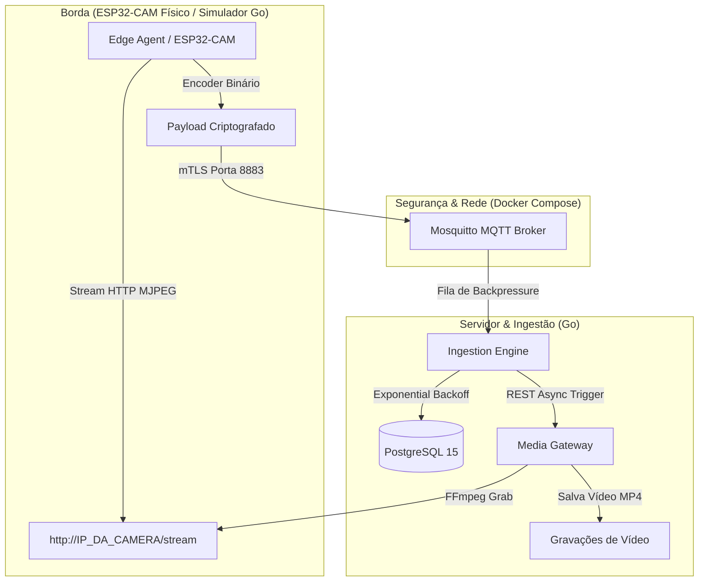

# SentinelNode 🛡️📹

**SentinelNode** é um ecossistema de vigilância de borda (IoT) e ingestão centralizada de vídeo de nível industrial. Projetado para rodar em hardware de baixo consumo (como o módulo físico **ESP32-CAM**) e servidores locais de home lab (como Proxmox), o sistema oferece criptografia de ponta a ponta, comunicação binária compacta de altíssima velocidade e persistência de dados tolerante a falhas críticas.

O ecossistema é composto por:
*   **firmware/**: Código C++ nativo para a placa **ESP32-CAM** (compatível com os sensores OV3660 e OV2640) integrado com sensor de presença PIR físico.
*   **edge-agent/**: Um simulador de câmera de alta fidelidade desenvolvido em Go (ótimo para testes rápidos sem hardware).
*   **ingestion-engine/**: O motor central que gerencia heartbeats, filas concorrentes de backpressure e persistência resiliente.
*   **media-gateway/**: O gateway de processamento que gerencia spawn assíncrono de processos FFmpeg para gravação de fluxos de vídeo locais.

---

## 🏗️ Arquitetura do Sistema



---

## 🌟 Principais Recursos

- **Protocolo Binário de Baixo Nível Customizado**: Elimina a verbosidade do JSON, compactando telemetria e alertas em bytes puros. Utiliza *Magic Numbers* (`0x53 0x4E` - "SN") para descarte imediato de tráfego invasor ou corrompido na camada de rede.
- **Segurança Mútua TLS (mTLS)**: Criptografia e autenticação por hardware. O Broker MQTT Mosquitto roda na porta segura **`8883`** exigindo que todos os clientes apresentem certificados digitais assinados por uma Autoridade Certificadora (CA) local confiável.
- **Injeção de Credenciais Segura (PlatformIO)**: Zero segredos e senhas de Wi-Fi no repositório. O firmware utiliza injeção de build flags via arquivo `private.ini` (oculto no `.gitignore`).
- **Resolução de IP Dinâmico via mDNS**: O ESP32-CAM localiza o servidor do Mosquitto dinamicamente usando o hostname do computador (ex: `computador.local`) eliminando falhas de conexão causadas por oscilação de IP DHCP do roteador.
- **Fila Concorrente & Backpressure**: O backend gerencia o consumo de eventos com buffers em memória para evitar picos de uso de memória RAM.
- **Resiliência Extrema**: Worker inteligente que insere dados no PostgreSQL utilizando política de **Backoff Exponencial** automático. Se o banco de dados cair, os dados acumulam com segurança na RAM e são gravados imediatamente após o restabelecimento da conexão.
- **Media Gateway Assíncrono**: Gerenciador de gravação de vídeo concorrente. Spawn de processos FFmpeg (`os/exec`) para captura de streams RTSP e HTTP MJPEG de câmeras reais com fallback inteligente e dinâmico caso a câmera esteja offline.
- **Configurações via Viper & `.env`**: Injeção dinâmica de parâmetros de infraestrutura, conexões e caminhos de arquivos.
- **100% Testado**: Cobertura de testes unitários nativos para garantir a integridade matemática da serialização e decodificação dos bytes de rede.

---

## 🛠️ Pré-requisitos

Para executar o ecossistema completo localmente:
*   **Go** (versão 1.22 ou superior)
*   **PlatformIO** (VS Code extension) para compilar o firmware
*   **Docker & Docker Compose**
*   **FFmpeg** instalado na máquina hospedeira

---

## 🚀 Como Executar

### 1. Inicializar a Infraestrutura de Chaves (mTLS)
Vá até a pasta `certs/` e execute o script automatizado para criar a sua CA e assinar as chaves dos microsserviços:
```bash
cd certs/
chmod +x generate_certs.sh
./generate_certs.sh
cd ..
```

### 2. Subir a Infraestrutura (PostgreSQL & Mosquitto)
Inicialize os containers em background:
```bash
docker compose up -d
```

### 3. Configurar e Gravar o Firmware (ESP32-CAM)
1.  Navegue até a pasta `firmware/`.
2.  Duplique o arquivo `private.ini.example` para **`private.ini`**:
    ```bash
    cp private.ini.example private.ini
    ```
3.  Abra o `private.ini` e configure suas credenciais de Wi-Fi e o hostname local da sua máquina:
    ```ini
    [env:esp32cam]
    build_flags =
        -D WIFI_SSID=\"NomeDoSeuWifi\"
        -D WIFI_PASS=\"SenhaDoSeuWifi\"
        -D MQTT_BROKER_IP=\"nome-do-seu-notebook.local\"
    ```
4.  Abra o arquivo [main.cpp](firmware/src/main.cpp), copie o conteúdo dos certificados gerados na sua pasta `certs/` e cole nas variáveis correspondentes: `ca_cert` (ca.crt), `client_cert` (client.crt), e `client_key` (client.key).
5.  Conecte o seu ESP32-CAM no computador via porta USB usando a placa-base MB e clique no botão **Upload** no VS Code PlatformIO para compilar e gravar!

### 4. Inicializar os Serviços de Backend
Abra abas separadas no terminal para rodar o servidor:

*   **Aba 1: Media Gateway (Porta HTTP 8080)**
    ```bash
    cd media-gateway
    go run main.go
    ```
*   **Aba 2: Ingestion Engine (Porta Segura 8883 + Postgres)**
    ```bash
    cd ingestion-engine
    go run cmd/main.go
    ```

---

## 🧪 Rodar os Testes Unitários

Para rodar os testes matemáticos de compatibilidade e decodificação do protocolo:

```bash
# No Edge Agent
cd edge-agent
go test -v ./internal/protocol/...

# No Ingestion Engine
cd ../ingestion-engine
go test -v ./internal/protocol/...
```

---

## 📚 Referências Técnicas & Manuais

Para entender a engenharia por trás do hardware utilizado neste projeto:
*   [Datasheet Oficial do Sensor Omnivision OV3660 (PDF)](https://www.ovt.com/wp-content/uploads/2022/01/OV03660-Product-Brief.pdf)
*   [Esquema Elétrico Oficial do ESP32-CAM AI-Thinker (PDF)](https://github.com/SeeedDocument/Camera_Shield-for-Raspberry-Pi/raw/master/resources/ESP32_CAM_V1.6.pdf)
*   [Especificações do Módulo ESP32-CAM MB & Pinout](https://lastminuteengineers.com/esp32-cam-pinout-reference/)

---

## 📄 Licença

Este projeto está licenciado sob a licença **MIT** - consulte o arquivo [LICENSE](LICENSE) para obter detalhes.
