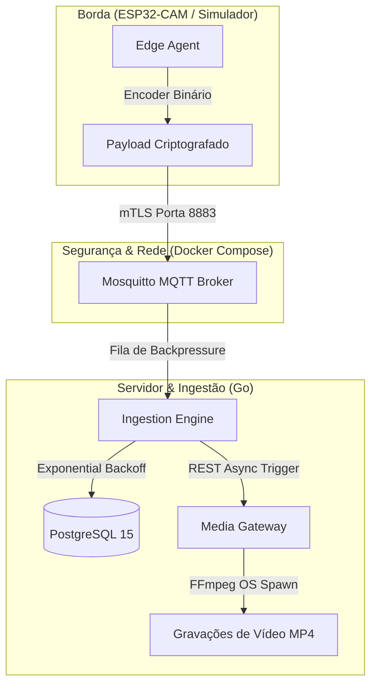

# SentinelNode 🛡️📹

**SentinelNode** é um ecossistema de vigilância de borda (IoT) e ingestão centralizada de vídeo de nível industrial. Projetado para rodar em hardware de baixo consumo (como o futuro ESP32-CAM) e servidores locais de home lab (como Proxmox), o sistema oferece criptografia de ponta a ponta, comunicação binária compacta de altíssima velocidade e persistência de dados tolerante a falhas críticas.

---

## 🏗️ Arquitetura do Sistema



---

## 🌟 Principais Recursos

- **Protocolo Binário de Baixo Nível Customizado**: Elimina a verbosidade do JSON, compactando telemetria e alertas em bytes puros. Utiliza *Magic Numbers* (`0x53 0x4E` - "SN") para descarte imediato de tráfego invasor ou corrompido na camada de rede.
- **Segurança Mútua TLS (mTLS)**: Criptografia e autenticação por hardware. O Broker MQTT Mosquitto roda na porta segura **`8883`** exigindo que todos os clientes apresentem certificados digitais assinados por uma Autoridade Certificadora (CA) local confiável.
- **Fila Concorrente & Backpressure**: O backend gerencia o consumo de eventos com buffers em memória para evitar picos de uso de memória RAM.
- **Resiliência Extrema**: Worker inteligente que insere dados no PostgreSQL utilizando política de **Backoff Exponencial** automático. Se o banco de dados cair, os dados acumulam com segurança na RAM e são gravados imediatamente após o restabelecimento da conexão.
- **Media Gateway Assíncrono**: Gerenciador de gravação de vídeo concorrente. Spawn de processos FFmpeg (`os/exec`) para captura de streams RTSP reais com fallback inteligente e dinâmico de 10 segundos caso a câmera física esteja offline.
- **Configurações via Viper & `.env`**: Zero segredos hardcoded. Toda a injeção de parâmetros de infraestrutura e portas é gerenciada por arquivos locais protegidos.
- **100% Testado**: Cobertura de testes unitários nativos para garantir a integridade matemática da serialização e decodificação dos bytes de rede.

---

## 🛠️ Pré-requisitos

Para executar e testar o ecossistema localmente, você precisará de:
* **Go** (versão 1.22 ou superior)
* **Docker & Docker Compose**
* **FFmpeg** instalado na máquina hospedeira

---

## 🚀 Como Executar

### 1. Clonar e Ajustar a Segurança
Certifique-se de que os arquivos de chaves secretas e configurações locais não serão rastreados pelo Git (o `.gitignore` já está configurado para isso):
```bash
git status
```

### 2. Gerar a Infraestrutura de Chaves (mTLS)
Vá até a pasta `certs/` e execute o script automatizado para criar a sua CA e assinar as chaves dos microsserviços:
```bash
cd certs/
chmod +x generate_certs.sh
./generate_certs.sh
cd ..
```

### 3. Subir a Infraestrutura (PostgreSQL & Mosquitto)
Inicialize os containers Docker em background:
```bash
docker compose up -d
```

### 4. Inicializar os Serviços locais

Abra três terminais ou abas para rodar os componentes:

* **Aba 1: Media Gateway (Porta HTTP 8080)**
  ```bash
  cd media-gateway
  go run main.go
  ```

* **Aba 2: Ingestion Engine (Porta Segura 8883 + Postgres)**
  ```bash
  cd ingestion-engine
  go run cmd/main.go
  ```

* **Aba 3: Edge Agent (Câmera simulada em mTLS)**
  ```bash
  cd edge-agent
  go run main.go
  ```

*No terminal do `edge-agent`, pressione a tecla `[Enter]` para simular fisicamente a detecção de um sensor de presença. Veja o vídeo sendo gravado na pasta `media-gateway/recordings/` e o evento salvo no PostgreSQL de forma resiliente!*

---

## 🧪 Rodar os Testes Unitários

Para rodar os testes matemáticos de compatibilidade e decodificação do protocolo:

```bash
# No Edge Agent
cd edge-agent
go test -v ./internal/protocol/...

# No Ingestion Engine
cd ../ingestion-engine
go test -v ./internal/protocol/...
```

---

## 📄 Licença

Este projeto está licenciado sob a licença **MIT** - consulte o arquivo [LICENSE](LICENSE) para obter detalhes.
